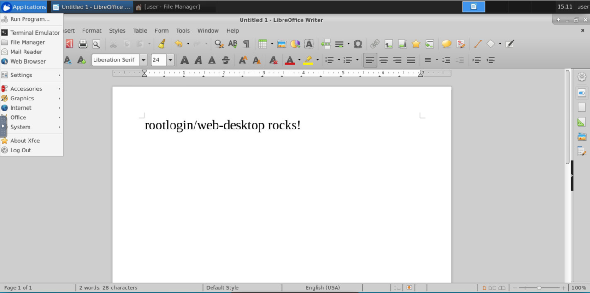

# Dockerized Xubuntu web desktop

[](https://microbadger.com/images/rootlogin/web-desktop "Get your own image badge on microbadger.com") [](https://microbadger.com/images/rootlogin/web-desktop "Get your own version badge on microbadger.com")  [](https://microbadger.com/images/rootlogin/web-desktop "Get your own commit badge on microbadger.com") [](https://quay.io/repository/rootlogin/web-desktop)



This image provides a dockerized web desktop based on Xubuntu 18.04 LTS (Xfce4). Thanks to noVNC you can access a full flegged linux desktop directly over your web browser.

## Features

 * Full flegged Xubuntu 18.04 desktop.
 * NoVNC with auto connect.
 * Password-less sudo.
 * OpenSSH client.

## Usage

To run this desktop enter:
```
docker run -p 80:8083 rootlogin/web-desktop
```

Then surf to [localhost](http://localhost) and have fun.

### Persistent user data

To persist user data you have to mount the volume /home/user:
```
docker run -p 80:8083 -v user_data:/home/user rootlogin/web-desktop
```

## Customizing

To customize your desktop create a child image, as example:

```
FROM rootlogin/web-desktop

RUN apt-get update \
  && DEBIAN_FRONTEND=noninteractive apt-get -y install \
  gimp \
  gimp-data \
  gimp-help-en
```

## Security notes

This image has no kind of encryption or authentication enabled. You should use a SSL frontend proxy with some kind of authentication (basic auth as example) like Nginx when you deploy this image in the public internet.

## FAQ

 * **Chromium browser does not work:** Yes because of the advanced sandboxing of Chromium which is not compatible with Docker. Try either to run this container privileged (`docker run --privileged rootlogin/web-desktop`) or start Chromium with disabled sandboxing (`chromium-browser --no-sandbox`).

## Contribution

This stuff is released under MIT license. I'm happy about every pull-request, that makes this tool better.
